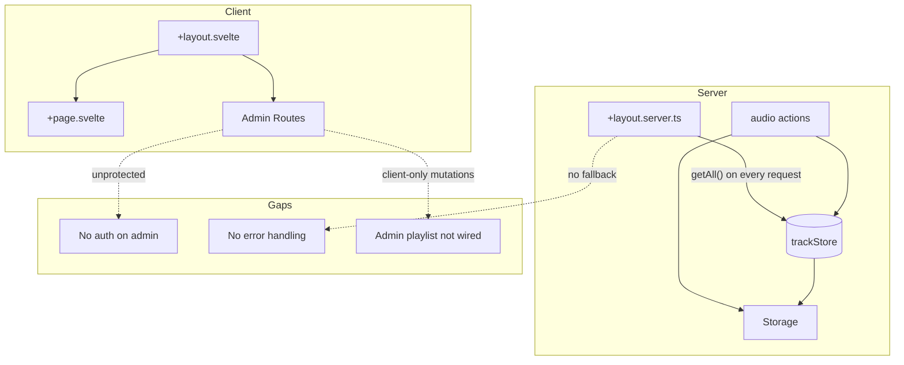

# SvelteKit Project Scaffolding Evaluation (2026)

## Executive Summary

The project has a solid foundation: Svelte 5 runes, Tailwind v4, Drizzle ORM, and a clean `$lib` structure. However, several **critical gaps** (unprotected admin routes, missing error handling, broken admin playlist persistence) and **architectural brittleness** (storage location, data loading strategy) need addressing before production.

---

## Strengths

| Area                    | Assessment                                                                                                                   |
| ----------------------- | ---------------------------------------------------------------------------------------------------------------------------- |
| **Svelte 5 usage**      | Correct runes (`$props`, `$derived`, `$state`), `.svelte.ts` for shared logic (AudioEngine, player-store). No legacy syntax. |
| **Dependencies**        | Modern stack: SvelteKit 2.x, Vite 7, Drizzle, Neon, TipTap. Versions are current.                                            |
| **Tooling**             | ESLint (flat config), Prettier, Knip, svelte-check. Cursor rules for import order and autofixer.                             |
| **Database**            | Drizzle schema with proper relations, indexes, and cascade deletes. Type-safe stores.                                        |
| **Storage abstraction** | Swappable provider pattern (local/r2/blob) documents future cloud migration path.                                            |
| **Routing**             | Uses `resolve()` from `$app/paths` for links (basePath-safe).                                                                |

---

## Critical Concerns

### 1. No Authentication / Authorization

**Risk: High.** Admin routes (`/admin`, `/admin/upload`, `/admin/playlist`) are **completely unprotected**. Anyone can upload, delete, or reorder tracks.

- No `hooks.server.ts` for session/auth
- No `src/lib/server/db` access control
- `app.d.ts` `Locals` interface is empty (no `user` or `session`)

**Recommendation:** Add auth before deployment. Options: Neon Auth (mentioned in project context), Better Auth, or SvelteKitAuth. Protect admin routes in `hooks.server.ts` or via layout `load` that redirects unauthenticated users.

---

### 2. Admin Playlist UI is Non-Persistent

**Risk: High.** The admin playlist page (`[src/routes/admin/playlist/+page.svelte](src/routes/admin/playlist/+page.svelte)`) has client-side `saveEdit`, `deleteTrack`, and `moveTrack` that **only mutate local state**. They never call the server actions defined in `[src/lib/server/actions/audio.ts](src/lib/server/actions/audio.ts)`.

- `deleteTrack` action exists but is never used (no form with `action="?/delete"`)
- `reorderTracks` action exists but is never used
- `saveEdit` has no server action at all (no `updateTrack` in audio.ts)

**Recommendation:** Wire forms to server actions: add `updateTrack` action, use `use:enhance` with `action="?/delete"` and `action="?/reorder"`, and call `invalidateAll()` after success.

---

### 3. No Error Handling

**Risk: Medium–High.** No SvelteKit error layer:

- No `src/hooks.server.ts` (no `handleError`, no `handle`)
- No `+error.svelte` at root or in routes
- No `error` boundary in layouts

If `trackStore.getAll()` throws (DB down, bad env), the app crashes with a generic error. No user-facing fallback.

**Recommendation:** Add `src/hooks.server.ts` with `handleError` (and optionally `handle` for auth). Add `src/routes/+error.svelte` for root error display. Consider `<svelte:boundary>` around critical sections (e.g. player).

---

### 4. Layout Loads All Tracks on Every Request

**Risk: Medium.** `[src/routes/+layout.server.ts](src/routes/+layout.server.ts)` runs `trackStore.getAll()` on every navigation. For a growing catalog this:

- Increases payload for every page (including `/contact`, `/photos`, etc.)
- Forces full load before any page can render
- Will not scale well

**Recommendation:** Load tracks only where needed:

- Move track loading to `+page.server.ts` for `/`, `/playlist`, and `/track/[id]`
- Use a shared layout that provides a minimal `tracks` (or `null`) and let child routes fetch their own data
- Consider pagination or “load on demand” for the player

---

### 5. Storage Module in `$lib` (Server-Only Code)

**Risk: Medium.** `[src/lib/storage](src/lib/storage)` uses Node `fs/promises` (via `LocalStorageProvider`) but lives under `$lib`, which is treated as shared. If any client component imports from `$lib/storage`, the build will fail or leak Node code to the client.

- Currently only used from `$lib/server` (actions, track-store), so it works
- Organization is fragile and violates SvelteKit’s server-only conventions

**Recommendation:** Move `src/lib/storage` → `src/lib/server/storage` and add `'server-only'` at the top of the module. Update imports in `track-store.ts` and `audio.ts`.

---

### 6. Storage Path Inconsistencies

**Risk: Low–Medium.** Path handling is inconsistent:

- Main audio: saved as `1234_Track.mp3` → URL `/1234_Track.mp3` (no `audio/` prefix)
- Images: saved as `images/1234_Track_image_0.jpg` → URL `/images/...`
- Additional audio: saved as `1234_Track_audio_0.mp3` → URL `/1234_Track_audio_0.mp3` (no `audio/` prefix)
- `track-store.delete()` uses `track.url.replace(/^\/audio\//, '')`; main audio URLs never match, so paths passed to `storage.delete()` have a leading `/`, which can break `path.join` on some systems

**Recommendation:** Standardize paths: save main and additional audio under `audio/` (e.g. `audio/${timestamp}_${safeName}.mp3`). Update `track-store.delete()` to strip leading slash before passing to `storage.delete()`, or normalize in the storage layer.

---

### 7. No `.env.example`

**Risk: Low.** `.gitignore` allows `.env.example`, but it does not exist. New developers have no reference for required variables (`DATABASE_URL`, future `STORAGE_*`, etc.).

**Recommendation:** Add `.env.example` with documented placeholders and required vars.

---

### 8. Drizzle Config Uses `process.env` Directly

**Risk: Low.** `[drizzle.config.ts](drizzle.config.ts)` uses `process.env.DATABASE_URL!` without validation. If unset, migrations fail with a cryptic error.

**Recommendation:** Validate at config load: `if (!process.env.DATABASE_URL) throw new Error('DATABASE_URL required for migrations')`.

---

## Moderate Concerns

### 9. Adapter Not Target-Specific

`[svelte.config.js](svelte.config.js)` uses `adapter-auto`. Fine for initial development, but you should pick a concrete adapter before production (e.g. `adapter-node`, `adapter-vercel`, `adapter-cloudflare`).

### 10. No Tests

No Vitest or Playwright. AGENTS.md’s “Define success criteria” and “Write tests” are not reflected in the codebase.

**Recommendation:** Add Vitest for unit tests (e.g. `track-store`, storage providers) and Playwright for key flows (upload, playback).

### 11. Rich Text and Security

`description` is stored as raw HTML from TipTap. There is no `@html` usage in the reviewed code for rendering it, but if you add it later, unsanitized HTML is an XSS risk.

**Recommendation:** When rendering, sanitize (e.g. `svelte-html` or DOMPurify) or restrict TipTap to a safe subset.

### 12. PersistentPlayer and Legacy Props

`[PersistentPlayer.svelte](src/lib/components/player/PersistentPlayer.svelte)` uses `let { initialTracks }: Props = $props()` without a default. If `initialTracks` is undefined, `initialTracks.length` can throw. Svelte 5 convention: `let { initialTracks = [] }: Props = $props()`.

---

## Brittle Foundations

| Foundation                | Issue                                                                                                         | Impact                                                                               |
| ------------------------- | ------------------------------------------------------------------------------------------------------------- | ------------------------------------------------------------------------------------ |
| **DB singleton**          | `getDb()` uses module-level variables; serverless environments may reinitialize, causing multiple connections | Generally fine for Neon HTTP; document behavior for cold starts                      |
| **PlayerStore singleton** | Module-level `engine`; HMR cleanup exists but no SSR guard                                                    | Ensure `getEngine()` is only called in browser (e.g. `$effect` with `browser` check) |
| **Static file layout**    | MP3s in `static/` root; docs say `static/audio/` and `static/images/`                                         | Consolidate and migrate existing files into `audio/` and `images/`                   |

---

## Architecture Diagram

---

## Prioritized Remediation Plan

### Phase 1: Critical (Before Any Production Use)

1. **Add authentication** – Protect `/admin/*` via hooks or layout load; populate `Locals` with session/user.
2. **Wire admin playlist** – Add `updateTrack` action; connect delete/reorder to forms; call `invalidateAll()` after mutations.
3. **Add error handling** – `hooks.server.ts` + `handleError`; root `+error.svelte`; optional boundaries for player.

### Phase 2: Structural (Before Scale)

1. **Move storage to server** – Relocate `$lib/storage` → `$lib/server/storage`; add `'server-only'`.
2. **Refactor track loading** – Load tracks only in `/`, `/playlist`, `/track/[id]`; avoid layout-wide `getAll()`.
3. **Standardize storage paths** – Use `audio/` and `images/` prefixes; fix delete path handling.

### Phase 3: Hardening

1. **Add `.env.example**`– Document`DATABASE_URL` and future provider vars.
2. **Validate Drizzle config** – Check `DATABASE_URL` before running migrations.
3. **Choose adapter** – Replace `adapter-auto` with a concrete adapter for your target platform.
4. **Test setup** – Add Vitest and Playwright for core flows.

### Phase 4: Optional

1. **Sanitize rich text** – Add sanitization if/when rendering `description` with `@html`.
2. **Fix PersistentPlayer props** – Add default for `initialTracks` in `$props()`.
3. **Content Security Policy** – Configure CSP in `svelte.config.js` if needed.

---

## Files to Create or Modify

| Action | File                                                                        |
| ------ | --------------------------------------------------------------------------- |
| Create | `src/hooks.server.ts`                                                       |
| Create | `src/routes/+error.svelte`                                                  |
| Create | `.env.example`                                                              |
| Move   | `src/lib/storage/*` → `src/lib/server/storage/*`                            |
| Modify | `src/routes/admin/playlist/+page.svelte` (wire actions)                     |
| Modify | `src/lib/server/actions/audio.ts` (add `updateTrack`)                       |
| Modify | `src/routes/+layout.server.ts` (remove or narrow track loading)             |
| Modify | `src/lib/server/db/track-store.ts` (fix delete path; update storage import) |
| Modify | `drizzle.config.ts` (env validation)                                        |
| Modify | `src/lib/components/player/PersistentPlayer.svelte` (props default)         |

---

## Conclusion

The scaffolding is well aligned with Svelte 5 and SvelteKit conventions. The main blockers are **security** (no auth), **correctness** (admin playlist not persisted), and **resilience** (no error handling). Addressing Phase 1 will make the app safe and usable; Phases 2–3 will improve scalability and maintainability.
